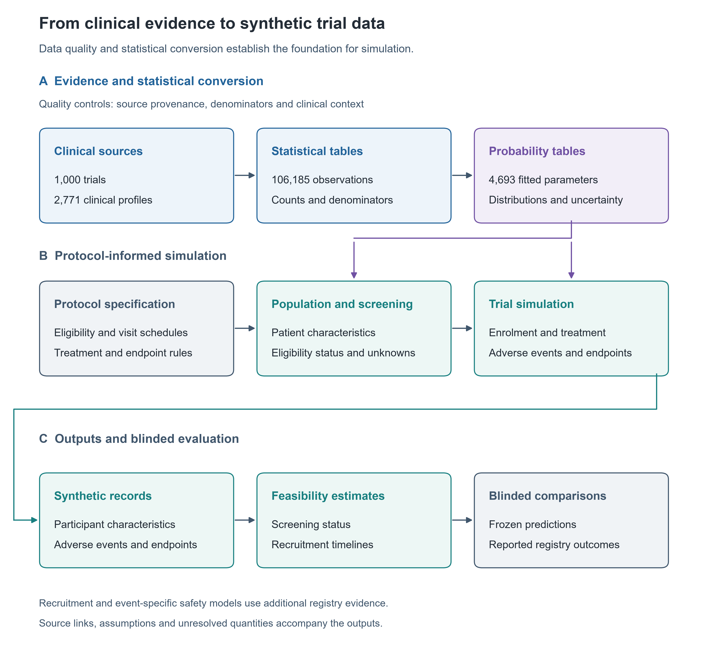
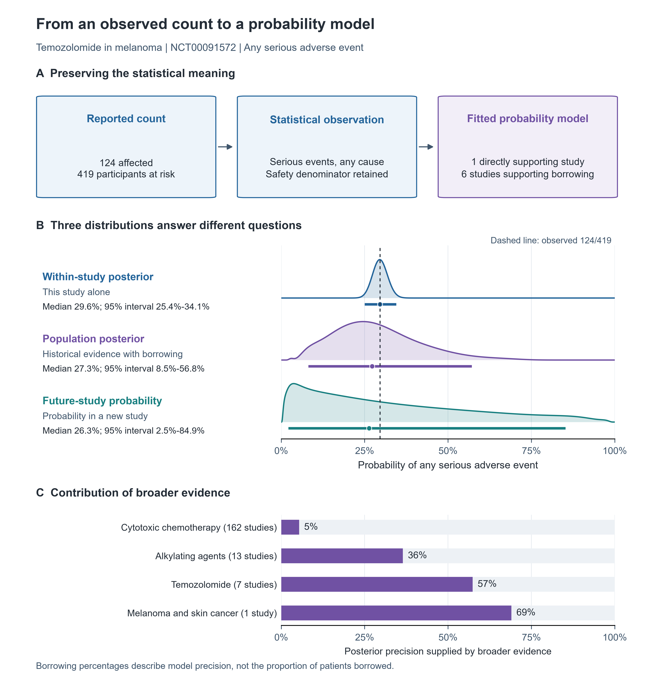
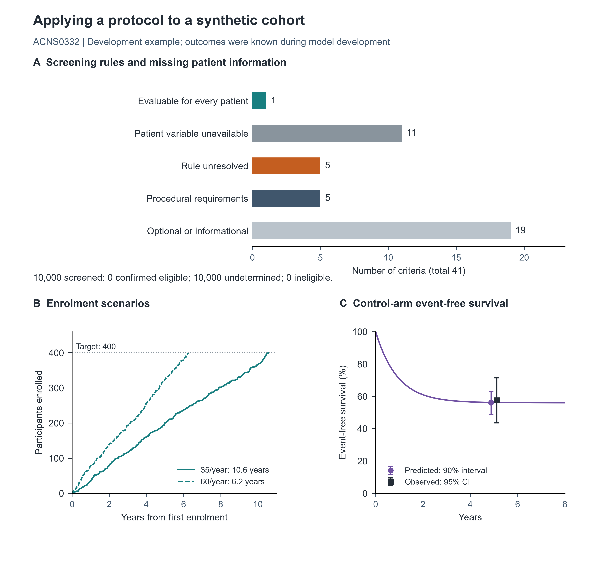
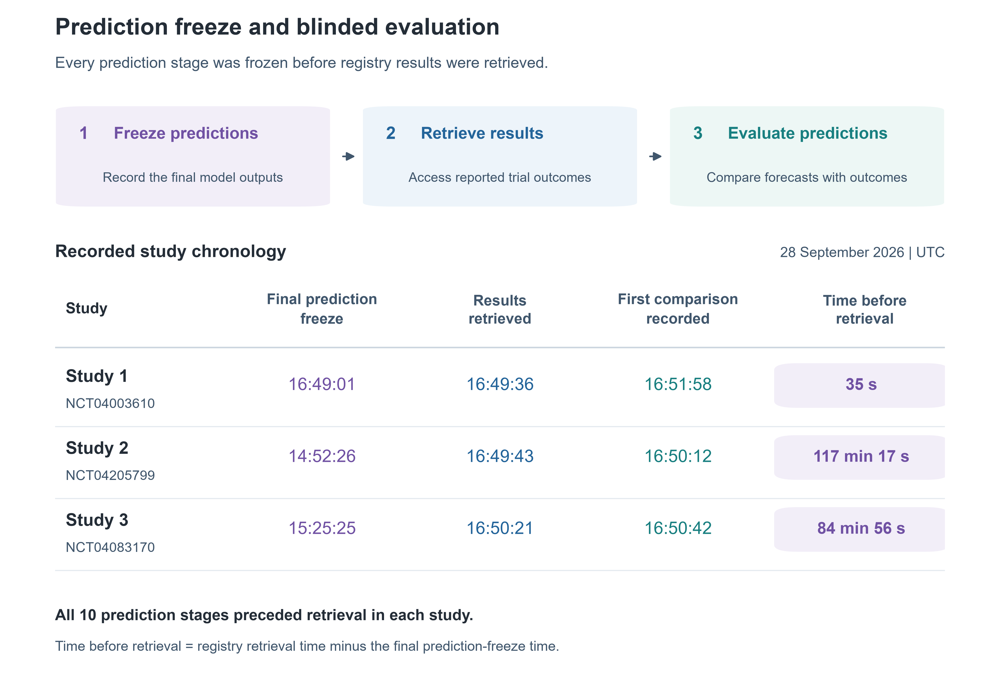
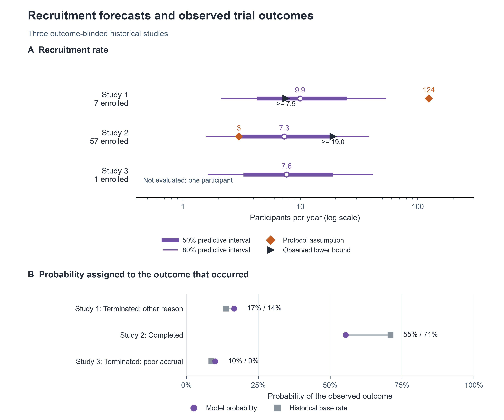
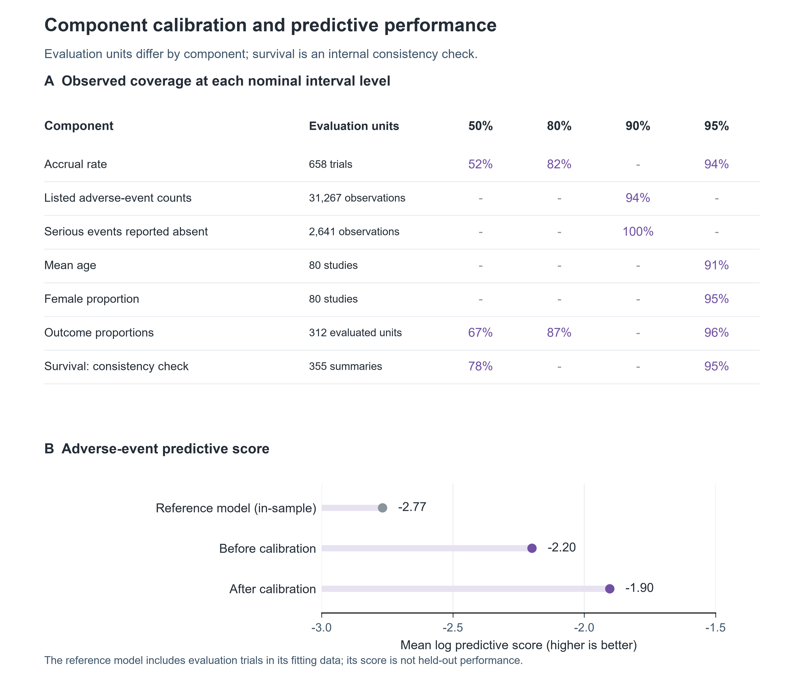
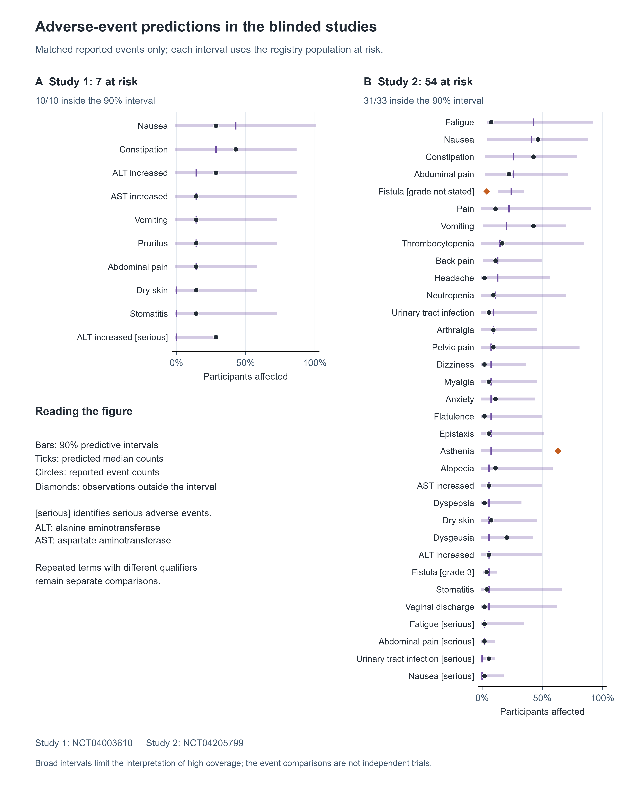
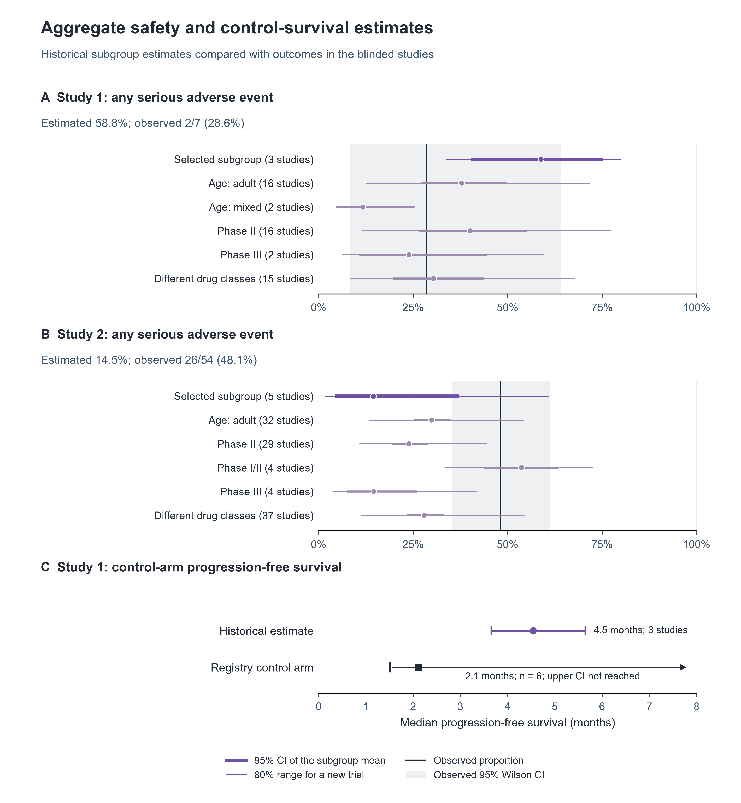

# Publication figure gallery

Eight revised figures with readable scientific labels, consistent typography and spacing, and no visible software versions, hashes or internal parameter codes. Scientific identifiers, qualifiers and uncertainty levels are retained.

Use **PDF** for scalable publication artwork, **SVG** for vector editing, or **PNG** for 600-dpi insertion. Every figure is 7.2 inches wide; use at full column-spanning width to retain legibility.

[Publication captions](CAPTIONS.md) | [Source provenance](figure_provenance.json)

| Figure | Content | Formats |
| --- | --- | --- |
| 1 | Evidence foundation and simulation | [PDF](fig1_pipeline.pdf) / [SVG](fig1_pipeline.svg) / [PNG](fig1_pipeline.png) |
| 2 | Observed counts to probability models | [PDF](fig2_evidence_lane.pdf) / [SVG](fig2_evidence_lane.svg) / [PNG](fig2_evidence_lane.png) |
| 3 | Protocol application and screening | [PDF](fig3_walkthrough_ACNS0332.pdf) / [SVG](fig3_walkthrough_ACNS0332.svg) / [PNG](fig3_walkthrough_ACNS0332.png) |
| 4 | Prediction-freeze timeline | [PDF](fig4_blind_timeline.pdf) / [SVG](fig4_blind_timeline.svg) / [PNG](fig4_blind_timeline.png) |
| 5 | Recruitment and trial outcomes | [PDF](fig5_accrual_blind.pdf) / [SVG](fig5_accrual_blind.svg) / [PNG](fig5_accrual_blind.png) |
| 6 | Calibration and predictive performance | [PDF](fig6_calibration.pdf) / [SVG](fig6_calibration.svg) / [PNG](fig6_calibration.png) |
| 7 | Event-level safety predictions | [PDF](fig7_blind_adverse_events.pdf) / [SVG](fig7_blind_adverse_events.svg) / [PNG](fig7_blind_adverse_events.png) |
| 8 | Aggregate safety and control survival | [PDF](fig8_blind_informative_estimates.pdf) / [SVG](fig8_blind_informative_estimates.svg) / [PNG](fig8_blind_informative_estimates.png) |

## Figure 1. Evidence foundation and simulation

## Figure 2. Observed counts to probability models

## Figure 3. Protocol application and screening

## Figure 4. Prediction-freeze timeline

## Figure 5. Recruitment and trial outcomes

## Figure 6. Calibration and predictive performance

## Figure 7. Event-level safety predictions

## Figure 8. Aggregate safety and control survival

